# Pokédex App

A Pokédex application developed with Flutter as a learning project. It uses the [PokeAPI](https://pokeapi.co/) to fetch Pokémon data and display them in a user-friendly interface.

## How to build

- Install Flutter

```sh
$ git clone https://github.com/LaBatata101/pokedex && cd pokedex
$ flutter build apk
```

The built APK will be in `build/app/outputs/apk/release/Pokédex-1.0.0-1-release.apk`.

## Main Features ✨

- **Navigation and Search:**
    - Pokémon list with infinite scroll.
    - Pokémon search by name with debounce.
    - Filters by Pokémon Type and Generation.
- **Comprehensive Pokémon Details:**
    - **Basic Information:** ID, height, weight, species, description (randomly obtained from a game version), base experience, base happiness, capture rate, growth rate, habitat, and generation.
    - **Sprites:** Image gallery with front, back, standard, and shiny sprites. Includes shine effect for shiny sprites.
    - **Types:** Display of Pokémon types with themed colors.
    - **Sounds (Cries):** Player to listen to the Pokémon's "Modern" and "Legacy" sounds.
    - **Base Stats:** Visualization of stats (HP, Attack, Defense, Special Attack, Special Defense, Speed) with colored progress bars.
    - **Stats Comparison:** Functionality to compare base stats with another searchable Pokémon.
    - **Type Effectiveness:** Shows weaknesses, resistances, and immunities (defensive) and advantages/disadvantages (offensive) against other types.
    - **Abilities:** Lists normal and hidden abilities with detailed descriptions, effects, and related Pokémon that also have the ability.
    - **Held Items:** Displays items that the Pokémon can hold in the wild, with rarity by game version and item description.
    - **Evolution Chain:** Presents the complete evolutionary line, including specific conditions to evolve (level, item, trade, happiness, time of day, etc.).
    - **Moves:** Detailed list of moves that the Pokémon can learn, with filters by learning method (Level Up, TM/HM, Egg, Tutor) and sorting options. Displays details of each move (Type, Class, Power, Accuracy, PP, description).
- **Special Visual Effects:**
    - Particle effect and badge for Legendary and Mythical Pokémon.
- **Performance:**
    - Uses local cache (SQLite) for API data, improving performance and reducing repeated requests.
    - Paginated loading of lists (Pokémon, Moves, etc.).

## Screenshots

### Home Screen

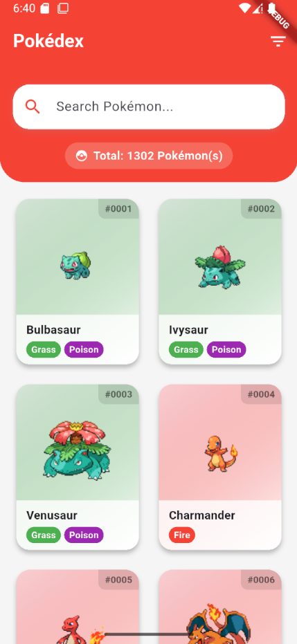

### Pokémon Details Screen

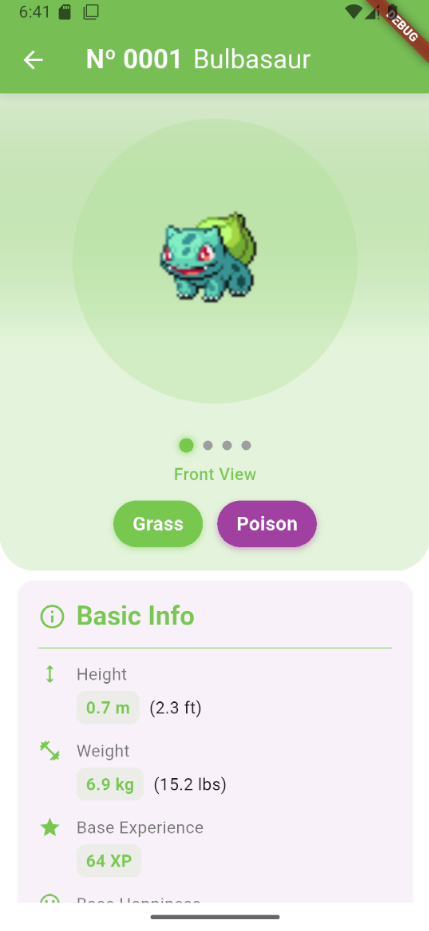

#### Basic Pokémon Info

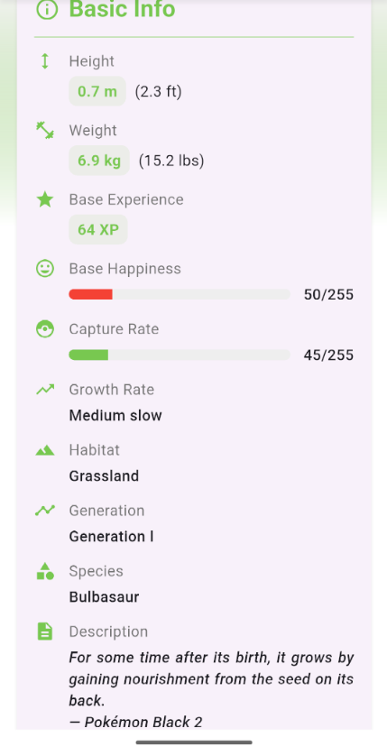

#### Pokémon Held Items

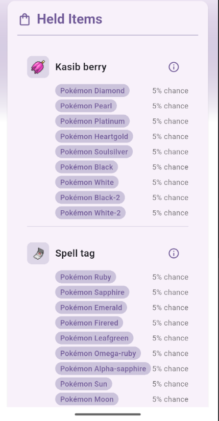

#### Base Pokémon Stats

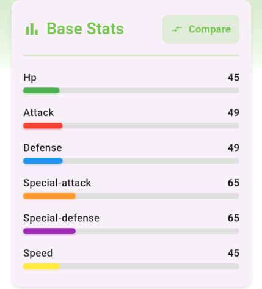
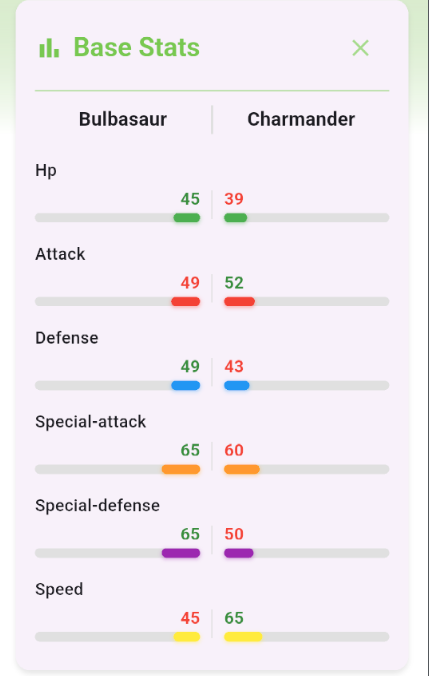

#### Pokémon Weaknesses and Strengths

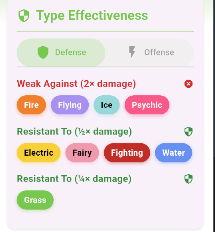
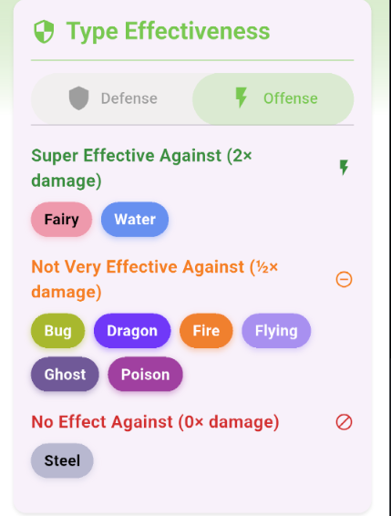

#### Abilities and Pokémon sounds

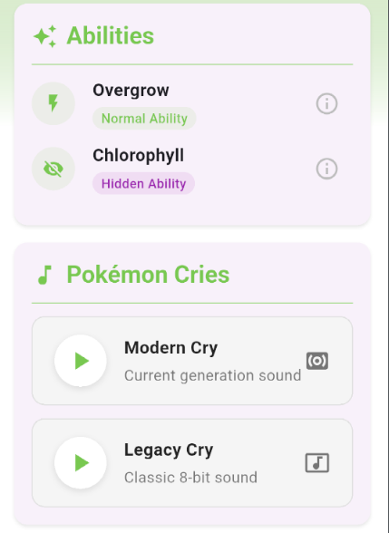
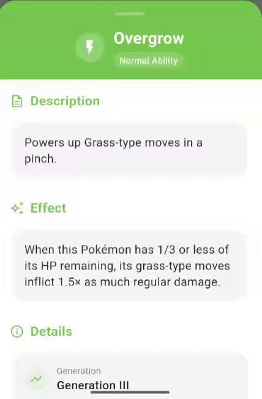

#### Pokémon Evolutions

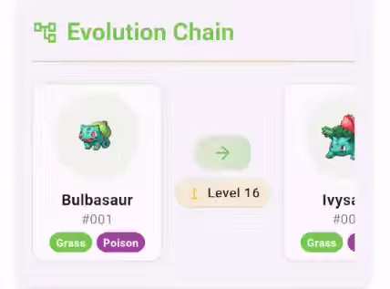

#### Pokémon Moves

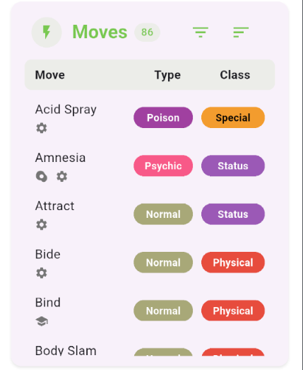
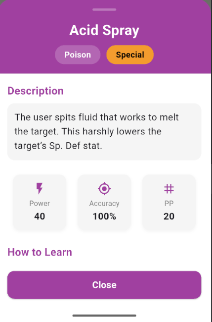

### Custom Animations

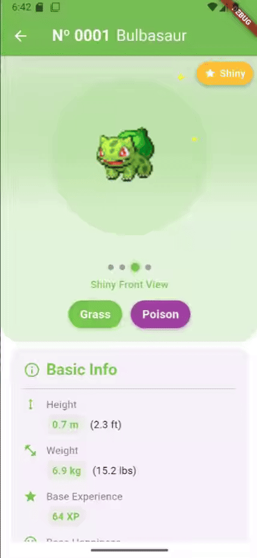
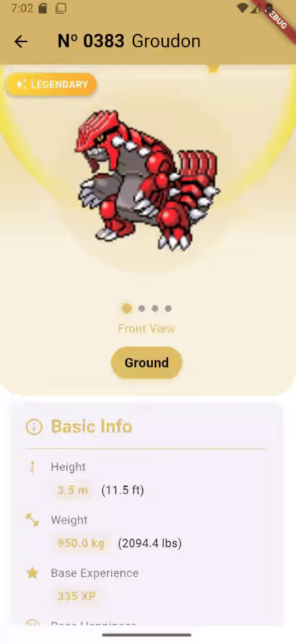
